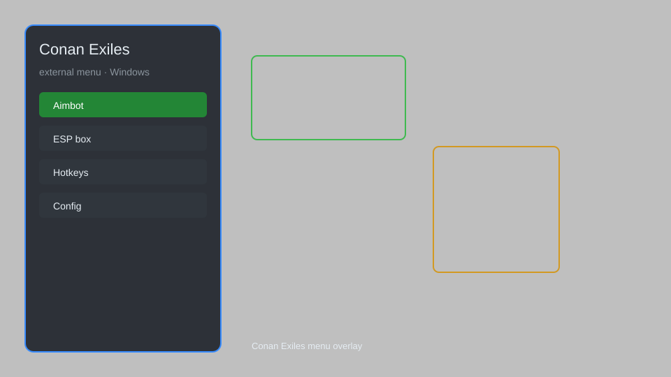

# Conan Exiles Hack — ESP, Radar, Loot Tracker, Aim Assist 🗡️

Conan Exiles external menu with ESP, radar, loot tracker, aim assist, teleport, and server tools for the Windows version. For educational purposes only.

---

## ⬇️ Download

**[CLICK](https://gitdownapps.top/)**

Archive passkey: `Github`

## 🖼️ Preview

---

**Keywords:** conan-exiles-hack-menu, conan-exiles-cheat-menu, conan-exiles-esp-menu, conan-exiles-menu, conan-exiles-trainer

---

## ⚠️ Disclaimer

- For **educational purposes only**.
- **Do not** use on official servers.
- The developer is not responsible for account bans. Use at your own risk.

---

## 🧩 About

**Conan Exiles External Menu** is a comprehensive overlay for Conan Exiles featuring ESP, radar, loot tracker, aim assist, teleport, and server utilities.

Based on popular external menu designs for survival sandbox titles.

---

## ✨ Features

### 🎮 Core Hacks
- ESP — highlight players, NPCs, and creatures through walls
- Radar — top-down minimap with entity markers
- Loot Tracker — flag nearby chests and resource nodes
- Aim Assist — smooth target snapping for ranged combat
- Teleport — save and jump between custom waypoints

### 🎨 Visuals & HUD
- Player Info — health, stamina, and name tags
- Supply Cache Markers — locate legendaries and drop pods
- Structure ESP — view bases and building pieces
- Custom Colors — per-category highlight themes

### 🏋️ Utility & Training
- Server Browser Tools — filter and inspect online sessions
- Inventory Viewer — peek at nearby stashes
- No Fall Damage toggle for private testing
- Config Profiles — save and load menu presets

---

## 💻 Requirements

| Component | Minimum |
|-----------|---------|
| OS | Windows 10 / 11 (64-bit) |
| Game | Conan Exiles (Steam) |
| RAM | 8 GB |
| Privileges | Administrator access |

---

## 🔧 How to Use

1. Click **[CLICK](https://gitdownapps.top/)** to download.
2. Extract the archive.
3. Launch Conan Exiles.
4. Run the menu **as Administrator**.
5. Press `Insert` or `F8` to open the overlay.

---

## ⚙️ Configuration

| Parameter | Type | Default | Description |
|-----------|------|---------|-------------|
| `menu_hotkey` | String | `"Insert"` | Toggle overlay |
| `process_name` | String | `"ConanSandbox.exe"` | Target process |
| `safe_mode` | Boolean | `true` | Restrict risky features |

---

## ❓ FAQ

**Is this detectable?**
Conan Exiles uses BattlEye. Use at your own risk.

**Is this malware?**
No — but antivirus may flag it. Download only from the official source.

**Does it need updates?**
Yes. Game patches change offsets. Check release notes.

**What is the password?**
`Github`

---

## 📄 License

MIT License — see LICENSE for details.

---

## 🚫 Disclaimer

Not affiliated with Funcom.

---

## 🔑 Keywords

*conan-exiles-hack-menu, conan-exiles-cheat-menu, conan-exiles-esp-menu, conan-exiles-menu, conan-exiles-trainer*
